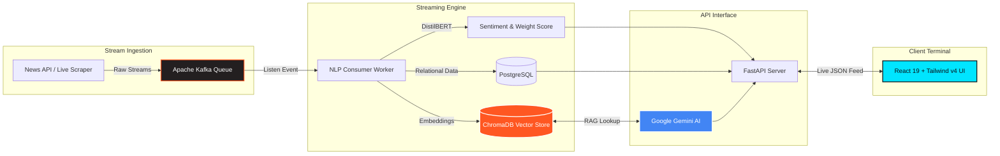

<div align="center">

# ⚡ PulseIQ — Real-Time AI News Intelligence Platform

**Next-Gen Autonomous Financial & Macro Sentiment Intelligence Terminal**

[](https://react.dev/)
[](https://tailwindcss.com/)
[](https://fastapi.tiangolo.com/)
[](https://kafka.apache.org/)
[](https://www.trychroma.com/)
[](https://deepmind.google/technologies/gemini/)
[](https://www.docker.com/)

---

A high-fidelity state-of-the-art streaming dashboard engineered for institutional-grade predictive sentiment analysis, real-time contagion mapping, and conversational search over global news streams via custom NLP and Vector Retrieval-Augmented Generation (RAG).

</div>

---

## 🌟 Visual Masterpieces & Features

PulseIQ brings deep visual feedback, responsive layouts, and granular analytics together into a seamless terminal design. 

### 🎨 Fully Adaptive Theme Engine (Dark & Light Mode)
- **State-of-the-Art CSS Architecture:** Implements customized adaptive properties integrated deeply with Tailwind CSS tokens.
- **Premium Themes:** Experience our signature neon-accented dark sci-fi mode (`#0B0E14` base) or seamlessly toggle to our pristine, ultra-clean light dashboard mode using the interactive toggle in the upper navigation bar. Fully persistent via LocalStorage.

### 🕸️ Real-Time Entity Threat Web
- **Nodal Matrix Mapping:** Watch global corporations, central banks, and critical geopolitical actors link together automatically based on continuous news feed vector co-mentions.
- **Contagion Exposure:** Nodes auto-assign threat weight classes (🔴 **Red** for high risk vectors, 🟢 **Green** for strong positive catalysts, and 🔵 **Cyan** for stable neutral assets). Includes custom Recharts force-directed node rendering with modern pill badges and inspectable side-drawers tracing audit evidence receipts.

### ⏳ Temporal Backtesting & Historical Analysis
- **Immersive Area Curves:** Backtest multi-vector stream reliability using custom harmonic Recharts area charts featuring sleek color stops and gradient fills.
- **Audit Registry Archive:** Search indexed trigger events, examine projected return alphas, and expand detailed inline backtest execution records with individual data source verification.

### 💬 Deep Pulse Conversational RAG Chat
- **Context-Aware Assistance:** Ask complex macroeconomic queries directly to our Gemini AI backend. 
- **Premium UX:** Includes clickable suggestion modules, direct stream citations, auto-resizing input arrays, and custom code-block markdown rendering formatted live as streams process.

---

## 🏗️ Enterprise System Architecture



---

## 📁 Repository Directory Structure

```text
PulseIQ/
├── frontend/                  # React 19 Client UI Platform
│   ├── public/login/          # Isolated Responsive Web2 Mobile-Optimized Portal
│   ├── src/
│   │   ├── components/        # Universal Components (TopAppBar, SideNav, LiveTicker)
│   │   ├── pages/             # Rich Module Viewports (ThreatWeb, Historical, Chat, Map)
│   │   ├── services/          # Data fetching layers and simulation fallbacks
│   │   ├── ThemeContext.jsx   # Global Theme & Persistence Provider
│   │   └── index.css          # Customized Tailwind Token Matrix & Overrides
│   ├── vite.config.js         # Production / Dev Engine Configurations
│   └── package.json           # Client Dependency Packages
│
├── api.py                     # FastAPI RAG Backend Core
├── consumer.py                # Message consumer, NLP inference, and Vector Injector
├── producer.py                # Kafka pipeline feed publisher
├── docker-compose.yml         # Unified Local Container Orchestration Stack
├── Dockerfile                 # Backend Application Builder
└── requirements.txt           # Python System Requirements
```

---

## 🚀 Getting Started & Execution Guide

You can easily deploy PulseIQ natively via Docker Compose or run both frameworks manually for advanced modification.

### Method 1: Instant Complete Orchestration (Recommended)
Make sure you have [Docker Desktop](https://www.docker.com/products/docker-desktop) installed.
1. Clone the repository and navigate inside:
   ```bash
   git clone https://github.com/HelloRohit26/PulseIQ.git
   cd PulseIQ
   ```
2. Build and boot up all connected message brokers, persistent volumes, backends, and frontend networks in parallel:
   ```bash
   docker-compose up -d --build
   ```
3. Access your secure intelligence instances immediately:
   - **Main UI Terminal:** [http://localhost:3000](http://localhost:3000)
   - **FastAPI Documentation:** [http://localhost:8000/docs](http://localhost:8000/docs)

### Method 2: Manual Local Execution
If you prefer running individual pipelines natively without container overhead:

**Booting Backend Layer:**
```bash
# Ensure Python 3.10+ is active
pip install -r requirements.txt
uvicorn api:app --reload --port 8000
```

**Booting Frontend UI Engine:**
```bash
cd frontend
npm install
npm run dev
```

---

## 🔒 Security Compliance & Robustness
- **API Availability Shields:** Client views implement smart simulation hooks rendering fully structured data arrays even during disconnected API networks to prevent infinite load states.
- **Mobile First Accessibility:** Custom media screens cover complete UI integrity down to mobile resolution viewports preventing overlapping UI frames.

---

<div align="center">
  <p className="text-xs text-slate-500 font-mono">
    Designed for absolute performance. Built with React, Tailwind CSS v4, FastAPI, Kafka, and Gemini AI.
  </p>
  <p>© 2026 PulseIQ Systems. All rights reserved.</p>
</div>
